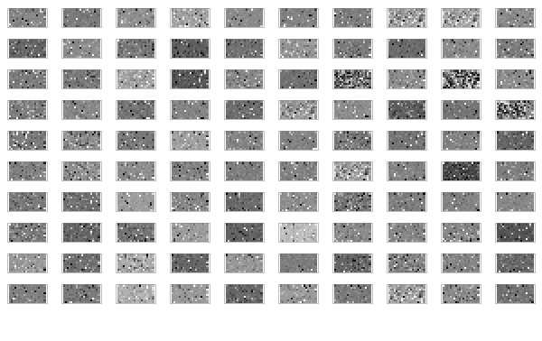
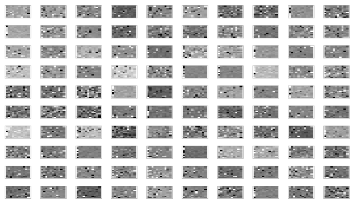
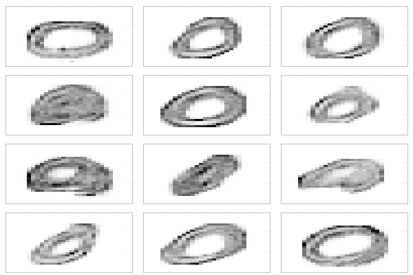
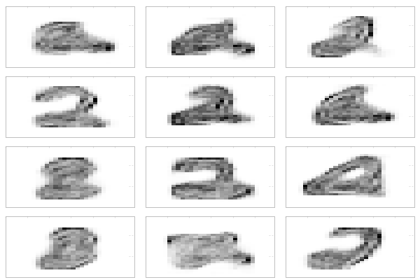
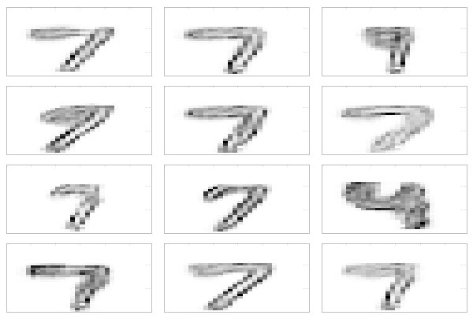
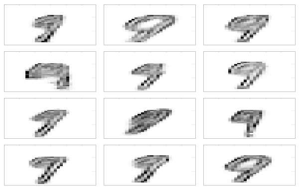

# RestrictedBoltzmannMaschine

# What is this

After completing [Geofrey Hintons Coursera "Neural Networks for Machine Learning" course](https://www.coursera.org/learn/neural-networks) I developed this hoppy application. I implemented the CD1 learning algorithm for Restricted Boltzman Maschines (RBM), stacked 3 RBMs and used them to generate number labels.

# Architecture

# Result

All followining images had following models:

| Layer  | # Iterations | # Hidden units |
| ------ | ------------ | -------------- |
| Layer1 | 10000        | 200            |
| Layer2 | 2500         | 100            |
| Layer3 | 2500         | 100            |

## Learned weights

### First Layer

### Second Layer

### Final Layer
First column represents the visible unit for the hot encoded labels (here not clamped but set to label while training).

## Generated numbers

The number where generated by clamping the 1 hot encoded labels while converging the "RBM 3" with 50000 iterations. Then we use the "Second Layer" activations as Hidden Units activations for a Sigmoid Belief Net with the "RBM 2" and "RBM 1" and "Visible Unit" as downstream layers.
The so generated "Visible Unit" activations are the generated image.

