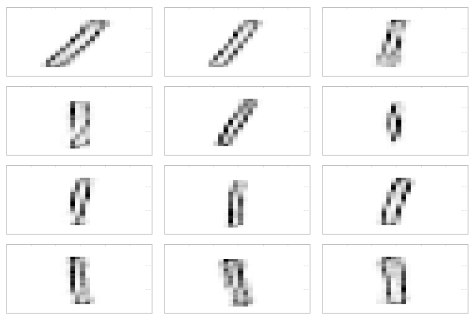

# RestrictedBoltzmannMaschine
RBM implemented with breeze.

All followining images had following models:

| Layer  | # Iterations | # Hidden units |
| ------ | ------------ | -------------- |
| Layer1 | 10000        | 200            |
| Layer2 | 2500         | 100            |
| Layer3 | 2500         | 100            |

## Learned weights

## Generated numbers

